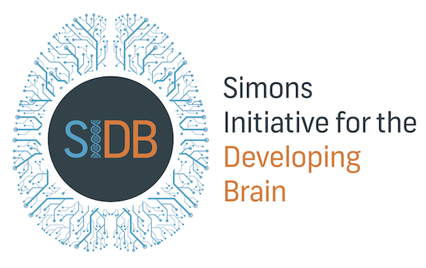

---

 [](https://github.com/celefthe/visiomode/actions)
[](https://codecov.io/gh/celefthe/visiomode)
[](https://github.com/psf/black)

Visiomode is an open-source platform for rodent touchscreen-based visuomotor tasks. It has been designed to promote the use of touchscreens as an accessible option for implementing a variety of visual task paradigms, with low-cost and ease-of-use as a priority. Visiomode is implemented on the popular Raspberry Pi computer, and provides the user with an intuitive web interface to design and manage experiments. It can be deployed as a stand-alone cognitive testing solution in both freely-moving and head-restrained environments.

## Installation

### Raspbian OS (recommended)

The recommended way to install Visiomode is by using `pipx` (<https://pypa.github.io/pipx/>). `pipx` will create an isolated python environment from which Visiomode will run, leaving the system python alone. This is the recommended way to install Visiomode, as it will not interfere with any other python packages you may have installed on your system.

First, make sure that your Raspbian OS is up-to-date.

```bash
sudo apt update && sudo apt upgrade
```

Visiomode runs on SDL 2.0. To make sure all system dependencies are present, run

```bash
sudo apt install libsdl2-mixer-2.0-0 libsdl2-image-2.0-0 libsdl2-2.0-0 libsdl2-ttf-2.0-0
```

Install `pipx` using

```bash
sudo apt install pipx
```

And finally, install Visiomode using `pipx`:

```bash
pipx install visiomode
```


### Linux / MacOS

While Visiomode primarily targets the Raspberry Pi OS, it can be installed on any Linux or MacOS machine, which can be useful for trying out the software before deployment, or for testing. Please note that only the Raspberry Pi OS is officially supported - your milage with any other Linux distribution or MacOS in production may vary.

The recommended way to install Visiomode is via `pipx` (<https://pypa.github.io/pipx/>).

```bash
pipx install visiomode
```

## Usage

To launch Visiomode, open a terminal and run

```bash
visiomode
```

If running over `ssh`, you will need to prepend `DISPLAY=:0` to the `visiomode` command to run the behaviour window on the primary display.

```bash
DISPLAY=:0 visiomode
```

This will launch the behaviour window (what the animal sees). The web interface can be accessed from any machine connected on the same network as the Raspberry Pi running Visiomode at `http://<YOUR-PI-HOSTNAME>.local:5000`, where `<YOUR-PI-HOSTNAME>` is the hostname of your Raspberry Pi. If you're unsure on what this is, run `hostname` in a terminal window.


## Upgrading

Use `pipx` to upgrade visiomode:

```bash
pipx upgrade visiomode
```

## Contributing

Visiomode is currently closed to PRs, except bugfixes. Please open an issue if you wish to contribute.


## Funders

<p align="left">
  
</p>
