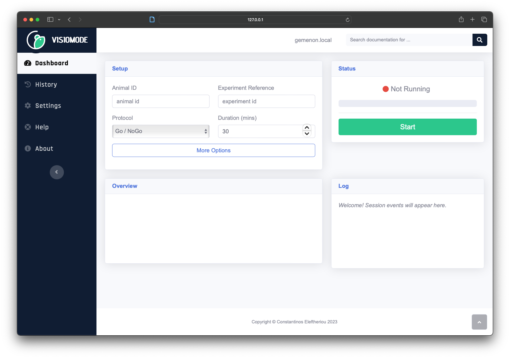

---

# Getting started

Visiomode is an open-source platform for rodent touchscreen-based visuomotor tasks. It has been designed to promote the use of touchscreens as an accessible option for implementing a variety of visual task paradigms, with low-cost and ease-of-use as a priority. Visiomode is implemented on the popular Raspberry Pi computer, and provides the user with an intuitive web interface to design and manage experiments. It can be deployed as a stand-alone cognitive testing solution in both freely-moving and head-restrained environments.

In this guide, we'll walk through the process of installing Visiomode on a Raspberry Pi computer. We'll also cover the basics of running Visiomode, and how to access the web interface. The next few sections will guide you through the process of [building an arena](building-an-arena.md), [running your first experiment](running-first-experiment.md) and [analysing Visiomode's behavioural data](data-analysis.md). But for now, let's get Visiomode up and running!

!!! note
    This guide assumes you want to set up Visiomode on a Raspberry Pi for behaviour experiments. If you're looking to set up Visiomode on a desktop computer for development or testing purposes, please see the [Development](reference/development.md) guide.

## Setting up your Raspberry Pi

The first thing you want to do is get your hands on a [Raspberry Pi 4](https://www.raspberrypi.org/products/raspberry-pi-4-model-b/) (or equivalent). Visiomode has been tested on the 2GB, 4GB and 8GB models, and all work well. The 2GB model is the cheapest option, but you should consider the 4GB and 8GB models if you're planning on running experiments with particularly complex visual stimuli (such as videos or animated sequences). You will also need a [microSD](https://uk.rs-online.com/web/p/raspberry-pi-os/1213897) (16GB or larger) to install the Raspberry Pi OS on. It is recommended that you buy a microSD card with [NOOBs]() pre-installed; alternatively, you can download the Raspberry Pi OS from the [Raspberry Pi website](https://www.raspberrypi.com/software/operating-systems/). You will need the **Raspberry Pi OS (64-bit) Desktop version**.

At this stage you can plug your Raspberry Pi into an external monitor for setup, but if you're keen to skip ahead you can install a [Hyperpixel 4.0](https://shop.pimoroni.com/products/hyperpixel-4?variant=12569485443155) (or equivalent touchscreen module) on your Pi at this stage. If you're planning to use a touchscreen, it's recommended that you attach the touchscreen module before installing the Raspberry Pi OS, as the touchscreen drivers are installed as part of the Raspberry Pi OS installation process. If you will be using the recommended Hyperpixel 4.0 display, no additional drivers will need to be installed as these are now part of the Raspberry Pi OS kernel.

Make sure you've connected an external keyboard and mouse to your Raspberry Pi, and insert the microSD card into the slot on the underside of the Pi. Connect the Pi to a power source, and the [Raspberry Pi OS installation process will begin](https://www.raspberrypi.com/software/). Follow the on-screen instructions to install the Raspberry Pi OS, making sure that you have an active internet connection (either via WiFi or Ethernet cable) during this process. Once the installation is complete, you will be greeted with the Raspberry Pi OS desktop.

## Installing Visiomode

The recommended way to install Visiomode is by using `pipx` (<https://pypa.github.io/pipx/>). `pipx` will create an isolated python environment from which Visiomode will run, leaving the system python alone. This is the recommended way to install Visiomode, as it will not interfere with any other python packages you may have installed on your system.

First, make sure that your Raspberry Pi OS is up-to-date. Open a new terminal window and run

```bash
sudo apt update && sudo apt upgrade
```

!!! tip
    If you are not familiar with running commands in the terminal, the Raspberry Pi project's handy [guide on how to use the terminal](https://projects.raspberrypi.org/en/projects/raspberry-pi-using/8#) will get you started!

Visiomode runs on SDL 2.0. To make sure all system dependencies are present, run

```bash
sudo apt install libsdl2-mixer-2.0-0 libsdl2-image-2.0-0 libsdl2-2.0-0 libsdl2-ttf-2.0-0
```

Install `pipx` using

```bash
sudo apt install pipx
```

And finally, install Visiomode using `pipx`:

```bash
pipx install visiomode
```

To launch Visiomode, open a terminal and run

```bash
visiomode
```

After a few moments you will be greeted with the Visiomode mouse interface:


This might not quite fit your screen yet, but don't worry - we'll fix this in a moment.

🎉 Congratulations! You've just installed Visiomode on your Raspberry Pi. The next section will walk you through accessing the web interface and running Visiomode remotely.

## Accessing the web interface

So far, we've install Visiomode and launched the mouse interface. But Visiomode's real power comes from its web interface, which allows you to design and manage experiments, and monitor your animals' performance in real-time.

!!! note
    If you've been following along, your Raspberry Pi should be connected to an external monitor (or a touchscreen display), as well as a keyboard and mouse. If you've been accessing your Raspberry Pi remotely this whole time  (i.e. through SSH) you can skip to the next section.

On the Raspberry Pi desktop, open a new browser window and navigate to `http://127.0.0.1:5000`. You will be greeted by the Visiomode web interface:



!!! tip
    Things not quite working as you'd expect? Head over to the [Troubleshooting](troubleshooting.md) page for some common issues and solutions.

While we're here, let's adjust the display settings for the mouse interface, so that it will run in fullscreen mode with the correct resolution on the Hyperpixel (or any other touchscreen) display. On the left-hand panel of the web interface, navigate to _Settings_ and select _Change display settings_.


This will launch a popup menu, where you can adjust the window width, height and toggle between fullscreen and window mode. Assuming you will be using the [Hyperpixel 4.0 display](https://shop.pimoroni.com/products/hyperpixel-4?variant=12569485443155) in landscape orientation, change the settings to the following:

- **Width**: 800
- **Height**: 480
- **Fullscreen**: True


!!! note
    If you're using a different touchscreen display, simply match these settings to its resolution and orientation. Running the mouse interface in fullscreen mode is strongly recommended.

Make sure you save your changes by clicking the _Save changes_ button at the bottom of the popup. Your changes will take effect next time you start Visiomode!

We've accessed the web interface from the Raspberry Pi itself, but having both mouse and web interfaces open at the same time on the same screen is far from ideal. What if we want to access the web interface from another computer? This would allow us to leave the mouse interface running at fullscreen on the touchscreen itself while we control the experimental parameters from a separate personal device. Sounds pretty neat - let's go ahead and do that!

You first need to work out what the IP address of your Raspberry Pi is on the network you're currently connected to. The easiest way to do this is to hover above the WiFi icon in the top-right corner of the Raspberry Pi desktop, which will display the IP address of your Raspberry Pi:


Alternatively, you can switch back to the terminal you used to launch Visiomode and take a look at the output after you ran the `visiomode` command (you may have to scroll up)


The second address circled above (i.e. not `127.0.0.1`) is the IP address of your Raspberry Pi. Make a note of this address, as we'll need it in a moment.

!!! tip
    Still having trouble? Check out the [official Raspberry Pi OS documentation](https://www.raspberrypi.com/documentation/computers/remote-access.html) for further guidance.

Now that you know the IP address of your Raspberry Pi, you can access the web interface from any device connected to the same network. Open a browser window on your personal device and navigate to `http://<YOUR-IP-ADDRESS>:5000`, where `<YOUR-IP-ADDRESS>` is the IP address of your Raspberry Pi. You will be greeted by the now-familiar Visiomode web interface!

## Running Visiomode remotely

So far, we've launched Visiomode from a local terminal and accessed the web interface both on the Raspberry Pi and from a separate device. But what if we want to run Visiomode remotely, without having to physically access the Raspberry Pi? Then all we'd have to do when running an experiment is switch the Raspberry Pi on, and we could set up and monitor our experiments from a separate device (or tablet!), without having to keep a monitor and external keyboard plugged in at all times. This is where `ssh` comes in.

If you've been following along so far, Visiomode is currently running on your Raspberry Pi as the result of you running the `visiomode` command in a terminal on its desktop. You should now quit Visiomode by switching to the terminal window where you ran the `visiomode` command and pressing `Ctrl+C` on your keyboard.

You will first need to enable `ssh` on your Raspberry Pi. On the Raspberry Pi, open a terminal window and run

```bash
sudo raspi-config
```

This will launch the Raspberry Pi configuration menu. Navigate to _Interfacing Options_ and select _SSH_. You will be asked if you want to enable `ssh` - select _Yes_ and press _Enter_. You will be returned to the main menu - select _Finish_ and press _Enter_ to exit the configuration menu.

Next, you will need to install an `ssh` client on your personal device. If you're using a Linux or Mac computer, you can use the built-in `ssh` client by opening a terminal window and running

```bash
ssh <YOUR-RPI-USERNAME>@<YOUR-IP-ADDRESS>
```

If you're using a Windows computer, you will need to install an `ssh` client such as [PuTTY](https://www.putty.org/). Once installed, open PuTTY and enter the IP address of your Raspberry Pi in the _Host Name_ field, and click _Open_. You will be prompted to enter your Raspberry Pi username and password, which you would have created during the Raspberry Pi OS installation process. Once you've entered your username and password, you will be greeted by the Raspberry Pi terminal.

Once you have an active `ssh` connection to your Raspberry Pi, you can launch Visiomode by running

```bash
DISPLAY=:0 visiomode
```

The mouse interface will appear on the screen (or touchscreen) attached to the Raspberry Pi, and you can access the web interface by opening a browser on your device and navigating to `http://<YOUR-IP-ADDRESS>:5000`.

🎉 Congratulations! You are all set to build an arena and start doing some science!🧑‍🔬

## Next steps

Now that you have a working installation of Visiomode, you can start putting together an arena for running your experiments. [Building an arena](building-an-arena.md) will guide you through the process of building a touchscreen arena, while [Running your first experiment](running-first-experiment.md) will walk you through the process of designing and running experiments.
