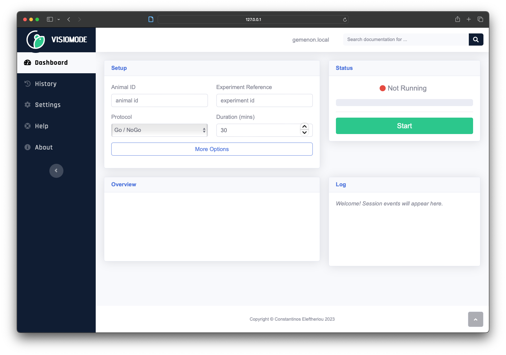

# Running your first experiment (with Visiomode)

!!! note
    This is a work in progress. Please check back later for updates!

Now that we've built our arena, we can start running experiments with Visiomode. This guide will walk you through the process of running your first experiment with Visiomode, from setting up the touchscreen module to running a simple behavioural task.

!!! note
    This guide follows the protocol found in our [protocols.io repository](http://dx.doi.org/10.17504/protocols.io.bumgnu3w), which we described in [Eleftheriou et al. 2023](https://doi.org/10.1016/j.jneumeth.2022.109779). Here we will consider only the touchscreen-reward association task; you can refer to the [protocols.io repository](http://dx.doi.org/10.17504/protocols.io.bumgnu3w) for the full protocol, which extends to nose-poke and forelimb-reaching visual discrimination tasks.

## Setting up the touchscreen module

1. Power on the Raspberry Pi 4 and wait for the desktop to load.

2. Connect to the raspberry pi via SSH.

3. Start the Visiomode server by running the following command:

    ```bash
    DISPLAY=:0 visiomode
    ```

4. Open a web browser on your computer and navigate to the following URL:

    ```bash
    http://<raspberry-pi-ip-address>:5000
    ```

    You should be greeted by Visiomode's web interface!

    

5. Adjust the nose-poke perspex insert in front of the touchscreen.

6. (Optional) Adjust screen brightness.

7. Test the reward system by clicking the "Dispense reward" button on the web interface.

## Running your first experiment

1. On the web interface, navigate to the "Dashboard" tab and change the task parameters to match the table below. Click "More Options" to see all available settings.

    | Setting                | Value                                   |
    |------------------------|-----------------------------------------|
    | Animal ID              | _The animal's identifier_               |
    | Experiment Reference   | _Identifier for the experimental cohort_ |
    | Protocol               | Single Target                           |
    | Duration               | 30                                      |
    | Reward Profile         | Water Reward                            |
    | Device Address         | _USB device path, usually /dev/ttyUSB0_ |
    | Inter-Trial Interval   | 4000                                    |
    | Stimulus Interval      | 10000                                   |
    | Target                 | Moving Grating                          |
    | Target Period (cycles) | 30                                      |
    | Target Contrast        | 1.0                                     |
    | Target Frequency (Hz)  | 1.0                                     |

2. Place the mouse in the arena and start the experiment by clicking the "Start" button on the web interface.

## Cleaning up


## Next steps

